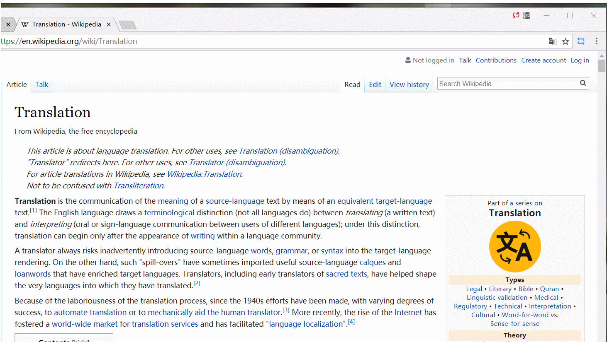
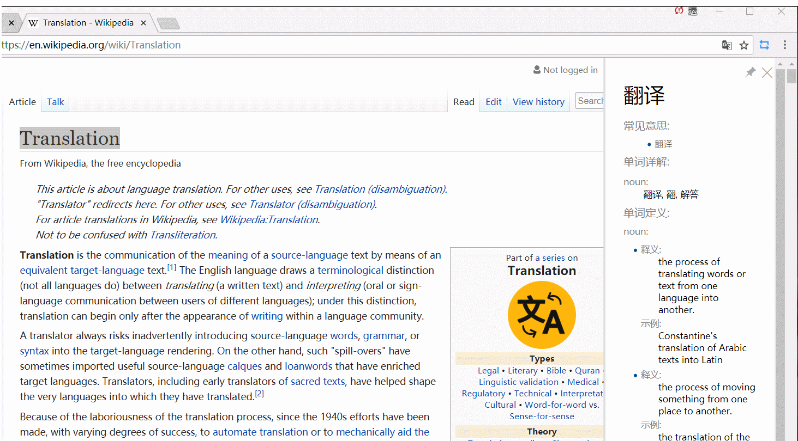
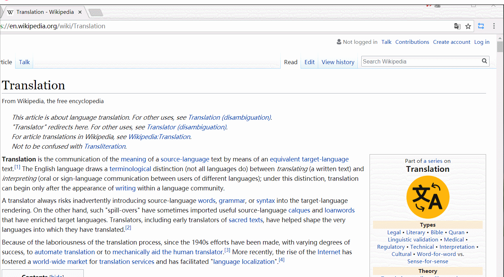

## Edge Translate Instructions

### Word Translation

* Method 1: Mouse select the word or sentence that needs to be translated, click the right mouse button to pop up the menu, select `Translate 'xxx'` to view the translation result.

* Method 2: Mouse select the word or sentence that needs to be translated, and click the [icon](../../images/icon.png) flag that pops up near the mouse cursor to translate.

* Method 3: Mouse select the word or sentence that needs to be translated, press the shortcut key to translate (this shortcut key must be customized in [Quick Key Settings] (chrome://extensions/shortcuts) if you want to use it. )

#### About the selected words immediately translated

If you feel that it is too much trouble to see the translation after clicking the word again, we offer two more radical translations:

* Double-click the word to translate immediately: Open the 'Double-click word to translate immediately' in the settings of this extension, just double-click the word you want to translate, and the translation result will be displayed immediately, no more operations are needed.

* Translate immediately after wording: If you can't meet your needs by double-clicking the word, you can conEdger enabling 'Translate immediately after wording'. When enabled, the translation result will be displayed immediately regardless of the way you select the text.

### Word Query

Click the  flag in the upper right corner of the browser or use the shortcut key (default `Alt + Q`) to enter the word you want to query in the input box of the pop-up page. Or sentence, then click the `Translate` button or press `Enter` to view the translation results.

### Fixed translation results

* Method 1: If you want to keep the translation result display bar always displayed, you can click the pushpin flag in the upper right corner of the translation result display bar to fix the display bar. After fixing it, clicking again will cancel the fixation.

* Method 2: Press the shortcut key (default `Alt + X`) to fix the display bar. After fixing it, press the shortcut key again (default `Alt + X`) will cancel the fixed

### Setting the translation language

Method 1: Click the  flag in the upper right corner of the browser. There is a downward arrow below the input box in the pop-up page. Click the arrow to expand the language setting. page.

Method 2: Click the  logo in the upper right corner of the browser and press the shortcut key (default `Alt + W`) to expand the language setting page. If you press again Under (default `Alt + W`) to hide the language setting interface

Method 3: Click the  flag in the upper right corner of the browser and press the shortcut key (default `Alt + S`) to complete the language exchange (__recommended) use__)

### Website Translation

* Have a web page translation

Using a web page translation interface with a channel translation, the effect is as follows:

The advantage of a good translation is that there is no webpage restriction, and almost any page can be translated (except for pdf documents); the disadvantage is that it can only be translated into Chinese and the target language cannot be changed.

* Google web page translation

Using the web translation interface of Google Translate, the effect is as follows:

The advantage of Google Translate is that you can freely choose the target language, and the translation speed is usually faster than the way. The disadvantage is that it cannot be translated on some pages, such as Github.

* Precautions

    - Whether you have a web page translation or a Google web page translation, you can only translate web pages, __can't translate pdf files!__

    - Due to the domestic network environment, Google's webpage translation may be unusable. Please use a webpage translation.

### Blacklist setting

Right click on the  flag in the top right corner of the browser and in the expanded options you can see `Add the current page to the blacklist' and `Add the current domain name to Blacklist`. Clicking 'Add current page to blacklist' will disable word translation and double-click translation on the current page; clicking `Add current domain to blacklist' will disable word translation on all pages with the same domain as the current page. Double click on the translation function.

If the  flag is displayed in the upper right corner of the browser, the domain name of the current page or the current page is in the blacklist. Right click on this flag will see Go to 'Move the current page out of the blacklist' or `Move the current domain name out of the blacklist', and click to re-enable the word translation and double-click translation on the current page.

### other settings

Right click on the  logo in the top right corner of the browser and click on 'Options' in the pop-up menu to go to the plugin settings page. Here you can set what needs to be displayed in the translation results and enable and disable word translation.

### Advanced usage scenarios

In order to further achieve the goal of convenient translation, we have added a number of shortcuts for Edge translation. Learn these shortcuts to turn your browser into a convenient word-searching software.

A typical usage scenario is:

1. On any non-initial page of the browser, press `Alt + Q` to open the search input box.

   * You may need to use `Alt + S` to exchange source and target languages

       + When the source language is `Automatically detect', the exchange is not supported. Please use the following method to set it manually.

   * Alternatively, you may need to use `Alt + W` to further set the source and target languages.

       + After setting the source or target language, press `Alt + W` again to turn off the language setting and return focus to the input box.

2. Type or paste the word you want to check and press `Enter` to view the translation result.

3. Press `Alt + X` to fix the translation result. Press `Alt + C` to close the translation result.

4. If you are not used to such a shortcut key combination, you can right-click on the  logo in the upper right corner of the browser and click `Shortcut Key Settings in the pop-up options. `Enter the shortcut key settings page, where you can customize all the shortcut keys for the Edge translation.