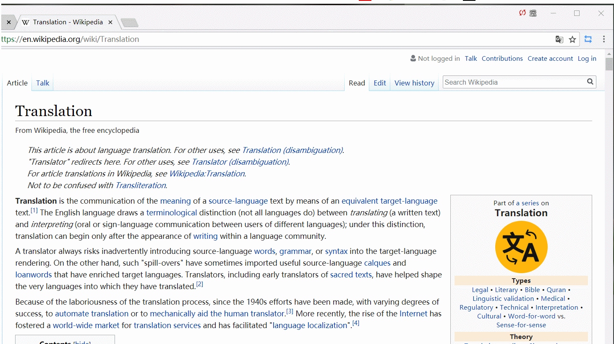
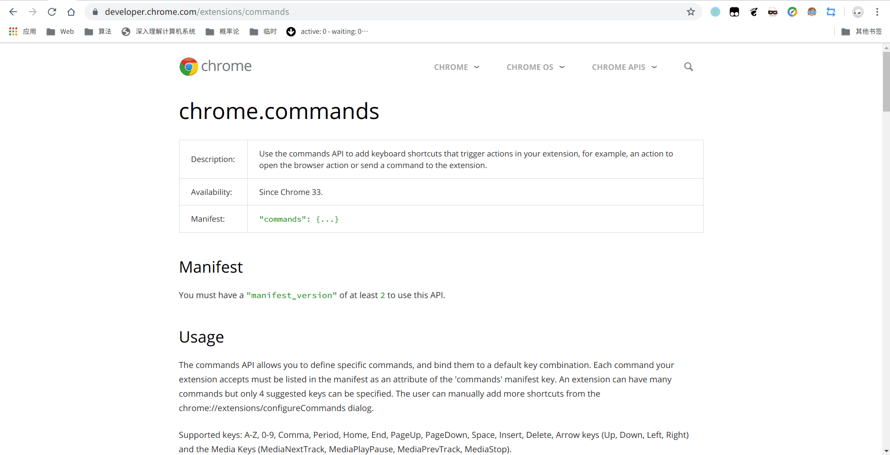
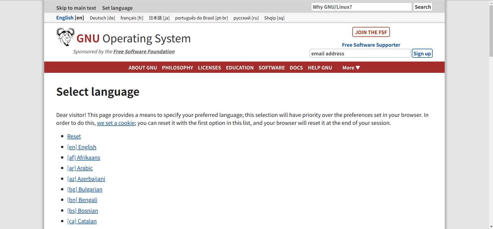
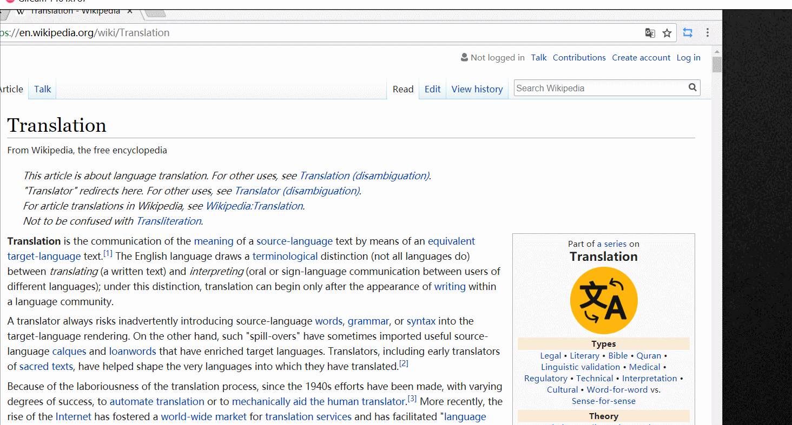

## 侧边翻译使用说明

### 选词翻译

* 方法一：鼠标选中需要翻译的单词或句子，点击鼠标右键弹出菜单，选择 `翻译 'xxx'` 即可查看翻译结果。

* 方法二：鼠标选中需要翻译的单词或句子，点击在鼠标光标附近弹出的标志即可翻译。

* 方法三：鼠标选中需要翻译的单词或句子，按下快捷键即可翻译(此快捷键如果要使用，必须先在[快捷键设置](chrome://extensions/shortcuts)中自定义快捷键)

#### 关于选中单词立即翻译

如果你觉得选中单词后还要再点一次鼠标才能看到翻译结果太麻烦的话，我们提供了两种更激进的翻译方式：

* 双击单词立即翻译：在本扩展的设置中开启`双击单词立即翻译`后，只需要鼠标左键双击你想翻译的单词，就会立刻展示翻译结果，不需要更多操作

* 划词后立即翻译：如果双击单词立即翻译还满足不了你的需求的话，可以考虑启用`划词后立即翻译`，启用后不论你以何种方式选中文本，都会立即展示翻译结果

### 单词查询

点击浏览器右上角的标志或者使用快捷键（默认`Alt + Q`），在弹出页面的输入框中输入你想查询的单词或句子，然后点击`翻译`按钮或按`Enter`键即可查看翻译结果。

### 固定翻译结果

* 方法一：如果你想保持翻译结果展示栏一直显示，可以点击翻译结果展示栏右上角的图钉标志来固定展示栏，固定之后再次点击将取消固定。

* 方法二：按下快捷键（默认`Alt + X`），可以将展示栏固定，已经固定后再次按下快捷键（默认`Alt + X`）将取消固定

### 设置翻译语言

方法一：点击浏览器右上角的标志，在弹出页面中输入框的下方有一个向下的箭头，点击箭头即可展开语言设置页面。

方法二：点击浏览器右上角的标志，按下快捷键（默认`Alt + W`）即可展开语言设置页面，如果再次按下（默认`Alt + W`）即可隐藏语言设置界面

方法三: 点击浏览器右上角的标志，按下快捷键(默认 `Alt + S`)，即可完成语言交换（__推荐使用__）

### 互译模式

* __什么是互译模式？__
  
  当用户主要在两种语言之间互相转换时，频繁交换源语言和目标语言将是非常烦人的一件事，因此我们推出了互译模式。在互译模式下，用户选中文本后插件会自动检测文本的语言，然后根据用户的设定将文本翻译到相对应的另一种语言。
  
  例如：用户将源语言设定为英文，将目标语言设定为中文，然后开启互译模式，那么当用户选中非中文的文本时，文本将会被翻译为中文，当用户选中中文文本时，文本将被翻译成英文。

  __注意：__ 当源语言设定为`自动检测`时，互译模式将会被强制关闭并且无法开启！

* __怎么开启/关闭互译模式？__

  点击浏览器右上角的标志，然后点击弹出框中的那个向下的箭头，即可看到互译模式的开关。
  
  互译模式也支持使用快捷键开启/关闭，但快捷键需要手动设置，并且只有在右上角弹出框开启的情况下才有效。

* __示例__

### 网页翻译

* 有道网页翻译

使用有道翻译的网页翻译接口，效果如图：

有道翻译的优点是没有网页限制，几乎可以翻译任何页面（pdf文档除外）；缺点是只能翻译到中文，不能更改目标语言。

* 谷歌网页翻译

使用谷歌翻译的网页翻译接口，效果如图：

谷歌翻译的优点是可以自由选择目标语言，并且翻译速度通常要比有道快；缺点是在某些页面上无法翻译，例如Github。

* 注意事项

    - 不论是有道网页翻译还是谷歌网页翻译都只能翻译网页，__不能翻译pdf文件！__

    - 由于国内的网络环境，谷歌网页翻译有可能会出现无法使用的情况，这时请使用有道网页翻译；

### 黑名单设置

右键点击浏览器右上角的标志，在展开的选项中可以看到`将当前页面添加到黑名单`以及`将当前域名添加到黑名单`。点击`将当前页面添加到黑名单`会禁用当前页面上的划词翻译和双击翻译功能；点击`将当前域名添加到黑名单`会禁用与当前页面同一域名的所有页面上的划词翻译和双击翻译功能。

如果浏览器右上角显示的是这个标志，说明当前页面或当前页面的域名在黑名单中，此时右键点击这个标志将会看到`将当前页面移出黑名单`或`将当前域名移出黑名单`，点击即可重新启用当前页面上的划词翻译和双击翻译功能。

### 其他设置

右键点击浏览器右上角的标志，在弹出选项中点击`选项`进入插件的设置页面。在这里你可以设置翻译结果中需要展示的内容以及启用和禁用划词翻译。

### 高级使用场景

为了更进一步实现便捷翻译的目标，我们为侧边翻译添加了许多快捷键。学会这些快捷键，即可将你的浏览器变成一个方便的查词软件。

一个典型的使用场景是：

1. 在浏览器的任意非初始页面，按`Alt + Q`打开查词输入框；

   * 你可能需要使用`Alt + S`交换源语言和目标语言

       + 当源语言是`自动检测`时不支持交换，请使用下面的方法手动设置

   * 或者，你可能需要使用`Alt + W`来进一步设置源语言和目标语言

       + 设置好源语言或目标语言后，再次按`Alt + W`即可关闭语言设置并使焦点回到输入框

2. 输入或粘贴想要查的词，按下`Enter`键查看翻译结果；

3. 按`Alt + X`可将翻译结果固定，按`Alt + C`可将翻译结果关闭；

4. 如果你不习惯这样的快捷键组合，可以`右键`点击浏览器右上角的标志，在弹出选项中点击`快捷键设置`进入快捷键设置页面，在这里你可以对侧边翻译的所有快捷键进行自定义。
